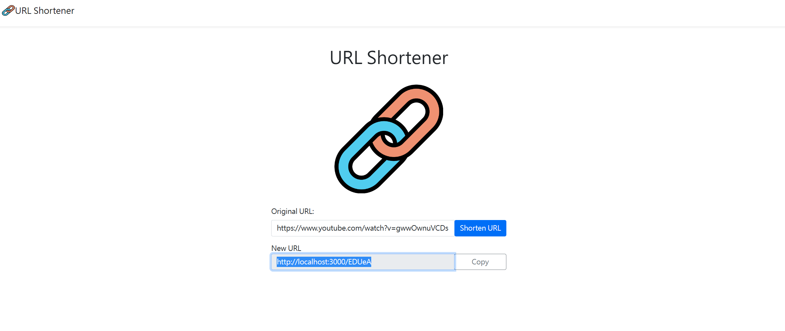

# URL Shortener



## Features - 功能

1. 使用者可以輸入網址
2. 使用者點擊 Shorten URl 後可轉換成短網址
3. 使用者可以點擊 copy 複製短網址，並跳出複製成功訊息
4. 使用者輸入短網址可跳轉回原網址
5. 使用者輸入同樣的網址，產生的短網址是一樣的
6. 若沒有輸入URL，會彈出警告!

## 環境設置
- Node.js
- MongoDB
- dotenv@16.0.3
- express@4.18.2
- express-handlebars@4.0.2
- mongoose@7.0.3

## Install 安裝與執行步驟

1. 開啟 Terminal, Clone 此專案至本機

```
git clone https://github.com/azx79115/Shorten-URL.git
```

2.開啟終端機進入此專案資料夾

3.安裝所需套件

4.啟動伺服器，執行app.js檔案

```
npm run dev
```

5.當終端機出現以下字樣，表示伺服器啟動成功

```
App is running on http://localhost:3000
mongodb connected!
```